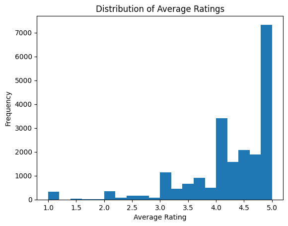
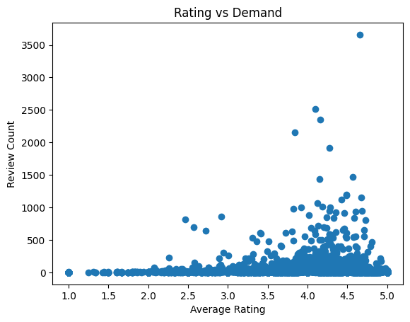
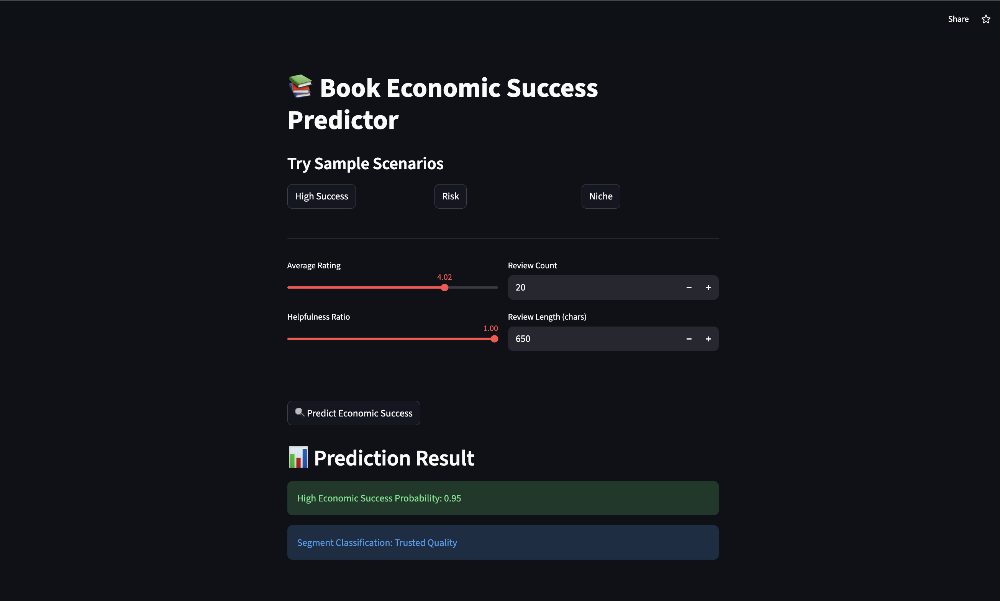

# 📚 Book Economic Strategy Using Review Patterns  

> An AI-driven economic analysis system to segment books and predict market success using review demand signals.

🌐 **Live Application:**  
https://book-economic-strategy-ml.streamlit.app/

---

## 🔍 Business Problem

In digital marketplaces, book performance depends on multiple economic signals:

- ⭐ Customer Ratings (Perceived Quality)  
- 📝 Review Volume (Demand Indicator)  
- 👍 Helpfulness Ratio (Trust Signal)  
- 💰 Price Positioning  

Sellers and publishers need a structured way to:

- Identify economically successful books  
- Detect high-risk inventory  
- Optimize pricing strategy  
- Improve revenue allocation decisions  

This project builds a machine learning engine to support those decisions.

---

## 📊 Dataset

**Amazon Books Reviews Dataset**  
https://www.kaggle.com/datasets/mohamedbakhet/amazon-books-reviews  

- 300,000+ review samples used  
- 21,000+ aggregated book-level records  
- Features include ratings, review text, helpfulness ratio, price, and demand metrics  

---

## 🧠 Economic Concepts Applied

This project integrates AI with core economic principles:

- **Demand-Supply Dynamics**
- **Market Segmentation**
- **Revenue Optimization**
- **Reputation Risk Analysis**
- **Price Elasticity Observations**

### Key Insight

> Economic success is driven primarily by the interaction between perceived quality (rating) and demand (review volume).

---

## ⚙️ Project Workflow

### 1️⃣ Data Cleaning & Preprocessing
- Missing value handling  
- Helpfulness ratio extraction  
- Review length feature engineering  
- Log transformation for skewed demand variables  
- Aggregation from review-level to book-level  

---

### 2️⃣ Exploratory Data Analysis (EDA)

- Distribution of average ratings  
- Skewness in review count  
- Log-transformed demand visualization  
- Rating vs Demand relationship  

#### 📊 Sample Visualizations





---

### 3️⃣ K-Means Clustering (Economic Segmentation)

Clustering performed:
- ❌ Without scaling (imbalanced clusters)
- ✅ With scaling (economically meaningful segmentation)

Identified segments:

- 🟢 **Trusted Quality** – High rating & strong trust  
- 🔴 **Risk Segment** – Low rating despite demand  
- 💎 **Premium Niche** – High price & low demand  
- 🔵 **Mass Market Leader** – High demand & strong rating  

---

### 4️⃣ Logistic Regression (Economic Success Prediction)

Baseline Model Accuracy: ~62%  

After Feature Engineering (rating × demand interaction):

Final Accuracy: **93.8%**

---

## 📈 Model Performance

### Performance Metrics

- **Accuracy:** 93.8%
- **Precision:** 96.4%
- **Recall:** 90.3%
- **F1 Score:** 93.28%
- **ROC-AUC:** 0.985

### Confusion Matrix

|                      | Predicted Not Successful | Predicted Successful |
|----------------------|--------------------------|----------------------|
| **Actual Not Successful** | 3230                     | 101                  |
| **Actual Successful**     | 292                      | 2728                 |

### Interpretation

- High precision reduces false investment in weak books.  
- High recall ensures strong performers are rarely missed.  
- ROC-AUC ≈ 0.99 indicates excellent class separation.  

---

## 🚀 Deployment

Interactive Streamlit application allows users to:

- Input book metrics  
- Predict economic success probability  
- View segment classification  

### 📱 Application Preview



---

## 📦 Repository Structure

```text
Book-Economic-Strategy-ML/
│
├── Book_Recommendation.ipynb
├── app.py
├── requirements.txt
├── model.pkl
├── scaler.pkl
├── images/
│   ├── avg_ratings.png
│   ├── rating_vs_demand.png
│   ├── colab_notebook.png
│   └── streamlit.png
└── README.md
```

---

## 🎯 Conclusion

This project demonstrates how combining:

- Economic reasoning  
- Feature engineering  
- Market segmentation  
- Predictive modeling  

can create a practical decision-support system for digital marketplaces.

It highlights the importance of **quality-demand interaction** as the primary driver of economic book success.

---

## 👨‍💻 Author

Soham  
AI / ML & Systems Engineering Enthusiast